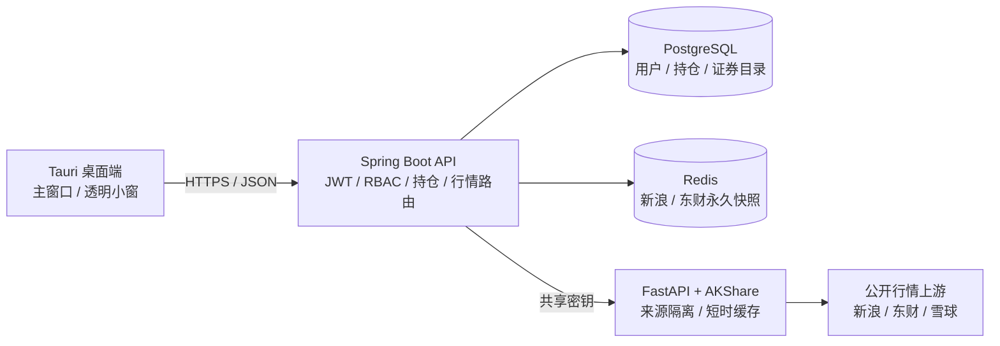

# 📈 股票盯盘助手

> 面向个人投资者的 Windows / macOS 桌面盯盘应用：自选持仓、实时盈亏、透明置顶小窗、多行情源与老板键，一处完成。

[](https://github.com/Super-liang/desktop_trading_assistant/releases/tag/v0.1.4)
[](https://github.com/Super-liang/desktop_trading_assistant/actions/workflows/ci.yml)


[](LICENSE)

当前版本：**v0.1.4** · [下载 Windows / macOS 安装包](https://github.com/Super-liang/desktop_trading_assistant/releases/tag/v0.1.4)

> [!WARNING]
> 项目当前通过 AKShare 对公开网站行情进行研究验证，数据可能延迟、限流或临时不可用，不构成任何投资建议，也不具备 ToC 商业行情展示与分发授权。正式商用前必须替换为合同明确授权的行情供应商。

## 目录

- [为什么选择它](#为什么选择它)
- [核心功能](#核心功能)
- [行情模式](#行情模式)
- [快速开始](#快速开始)
- [macOS + Apple Container 源码启动](#macos--apple-container-源码启动)
- [系统架构](#系统架构)
- [测试与构建](#测试与构建)
- [云端部署](#云端部署)
- [项目结构](#项目结构)
- [路线图](#路线图)
- [安全与合规边界](#安全与合规边界)

## 为什么选择它

| 场景 | 股票盯盘助手的处理方式 |
| --- | --- |
| 上班时不方便打开完整行情软件 | 透明、无边框、置顶小窗，只展示需要的文字行情 |
| 老板靠近需要快速隐藏 | 全局快捷键 `Cmd/Ctrl + Shift + H` 一键隐藏或恢复全部窗口 |
| 只关心自己的持仓 | 手动录入股票、数量与成本，实时计算市值和浮动盈亏 |
| 公开行情源偶尔不稳定 | 新浪/东财全市场快照独立缓存；单股模式可切换东财/雪球并显示联通状态 |
| 希望掌控刷新节奏 | 全市场频率由管理员统一控制；单股查询由用户选择 2/5/10/20 秒 |
| 不想把券商密码交给第三方 | 一期不连接券商、不执行交易、不采集交易账号和密码 |

## 核心功能

### 桌面体验

- ✅ Windows x64 与 macOS Apple Silicon 桌面安装包
- ✅ Tauri 2 原生窗口、系统托盘与全局老板键
- ✅ 100% 透明背景盯盘小窗，仅保留行情文字
- ✅ 小窗置顶、自由缩放、内容动态缩放、文字透明度调节
- ✅ 主窗口固定在当前可视区，长列表在卡片内部滚动
- ✅ 根级错误恢复界面，异常行情不会再让安装版整页黑屏

### 自选与持仓

- ✅ A 股代码/名称搜索，自选添加与编辑
- ✅ 手动设置持仓数量和成本价，支持小数成本
- ✅ 实时展示现价、市值、浮动盈亏和收益率
- ✅ 每日 08:00 从 AKShare 更新 A 股代码与名称到 PostgreSQL
- ✅ 非交易时段继续展示最后一次成功快照

### 账号与后台

- ✅ 用户注册、登录、刷新令牌轮换与安全退出
- ✅ JWT + BCrypt + RBAC 权限控制
- ✅ 管理员用户查询、启用/禁用和审计入口
- ✅ 普通用户可切换自己的行情模式和来源
- ✅ 只有管理员可以修改服务端全市场快照刷新频率

### 行情链路

- ✅ AKShare FastAPI 独立网关，桌面端不直接访问公开行情接口
- ✅ 全市场新浪、东方财富双源并行刷新和独立健康状态
- ✅ Redis 按来源永久保存最后成功快照，刷新只更新对应来源
- ✅ 单股东方财富、雪球按请求查询，保留短时缓存与并发合并
- ✅ 首页展示 Spring API、AKShare、Redis 和具体上游联通灯
- ✅ `QuoteProvider` SPI 可继续接入有授权的生产行情源

## 行情模式

<!-- markdownlint-disable MD013 -->

| 模式 | 可选来源 | 刷新机制 | 适用场景 |
| --- | --- | --- | --- |
| 全市场快照 | 东方财富 / 新浪 | 服务端在 A 股交易时段并行刷新并写入两份 Redis；管理员配置统一频率，范围 30–300 秒 | 自选较多、希望所有用户共享一次抓取 |
| 单只股票 | 东方财富 / 雪球 | 客户端按 2/5/10/20 秒轮询，默认 10 秒；服务端按用户选择实时请求或复用短时缓存 | 自选较少、希望降低单只股票延迟 |

<!-- markdownlint-enable MD013 -->

普通用户可以自由切换工作模式、全市场读取来源、单股来源和单股查询频率。这些选择保存在当前设备，不会修改其他用户的选择；管理员配置作为客户端首次使用时的默认值。

## 快速开始

### 方式一：直接下载安装包

前往 [GitHub Release v0.1.4](https://github.com/Super-liang/desktop_trading_assistant/releases/tag/v0.1.4)：

| 系统 | 下载文件 |
| --- | --- |
| macOS Apple Silicon | `StockTradingAssistant_0.1.4_macos-arm64.dmg` |
| macOS APP 压缩包 | `StockTradingAssistant_0.1.4_macos-arm64.app.zip` |
| Windows x64 | `StockTradingAssistant_0.1.4_windows-x64-setup.exe` |

Release 同时提供两个平台的 `SHA256SUMS.txt`。建议下载后先校验文件完整性。

macOS 当前安装包使用 ad-hoc 签名，尚未完成 Apple notarization。首次打开若被
Gatekeeper 拦截，请在 Finder 中右键应用选择“打开”，或前往“系统设置 →
隐私与安全性”确认打开；不要从非本仓库 Release 的来源下载安装包。

Windows 安装器当前没有商业代码签名证书，SmartScreen 可能显示未知发布者。请先核对 SHA-256，仅对本仓库 Release 下载的文件选择继续运行。

安装包已内置云端 API 地址，安装后直接注册或登录即可体验。

### 方式二：从源码开发

基础依赖：

- Node.js 22+
- JDK 17
- Rust stable
- Python 3.11（建议）
- PostgreSQL 16+
- Redis 7+

macOS 且不使用 Docker 时，推荐直接采用下一节的 Apple Container 完整流程。
其他系统可以自行启动 PostgreSQL 与 Redis，再从“启动 AKShare 网关”开始执行。

> `docker compose up --build` 当前只提供 PostgreSQL + Spring API 的基础组合，
> 不包含 Redis 和 AKShare 完整真实行情链路。

## macOS + Apple Container 源码启动

以下命令适用于 Apple Silicon Mac，并让每个服务运行在独立终端中，方便随时按 `Ctrl + C` 停止应用服务。

### 1. 准备代码和本地配置

```bash
git clone https://github.com/Super-liang/desktop_trading_assistant.git
cd desktop_trading_assistant
npm ci

cp .env.example .env
openssl rand -hex 24
```

编辑 `.env`，至少完成以下修改：

```dotenv
POSTGRES_PASSWORD=替换为本地数据库密码
DB_PASSWORD=与_POSTGRES_PASSWORD_相同
JWT_SECRET=替换为至少32字节的随机字符串
ADMIN_EMAIL=替换为管理员邮箱
ADMIN_PASSWORD=替换为至少12位且包含字母和数字的管理员密码

QUOTE_HTTP_ENABLED=true
QUOTE_HTTP_BASE_URL=http://127.0.0.1:8090
QUOTE_HTTP_API_KEY=替换为刚才生成的随机值
AKSHARE_API_KEY=与_QUOTE_HTTP_API_KEY_相同
```

`.env` 只用于本机开发，已经被 Git 忽略；不要提交任何真实密码或密钥。

### 2. 首次创建 PostgreSQL 与 Redis

```bash
container system start

container volume create trading-postgres-data
container volume create trading-redis-data

set -a
source .env
set +a

container run -d --name trading-postgres \
  -p 127.0.0.1:5432:5432 \
  -e POSTGRES_DB -e POSTGRES_USER -e POSTGRES_PASSWORD \
  -v trading-postgres-data:/var/lib/postgresql/data \
  docker.io/library/postgres:16-alpine

container run -d --name trading-redis \
  -p 127.0.0.1:6379:6379 \
  -v trading-redis-data:/data \
  docker.io/library/redis:7-alpine \
  redis-server --appendonly yes
```

健康检查：

```bash
container exec trading-postgres \
  pg_isready -U trading -d trading_assistant
container exec trading-redis redis-cli ping
```

如果容器已经创建，后续只需：

```bash
container system start
container start trading-postgres
container start trading-redis
```

### 3. 安装并启动 AKShare 网关（终端一）

首次安装 Python 依赖：

```bash
cd desktop_trading_assistant
python3 -m venv services/akshare-gateway/.venv
services/akshare-gateway/.venv/bin/python -m pip install \
  -r services/akshare-gateway/requirements.txt
```

每次启动：

```bash
cd desktop_trading_assistant
set -a
source .env
set +a

services/akshare-gateway/.venv/bin/python -m uvicorn \
  akshare_gateway.app:create_app \
  --factory --app-dir services/akshare-gateway \
  --host 127.0.0.1 --port 8090
```

验证：

```bash
curl http://127.0.0.1:8090/health
```

### 4. 启动 Spring API（终端二）

```bash
cd desktop_trading_assistant
set -a
source .env
set +a

cd services/api
JAVA_HOME=$(/usr/libexec/java_home -v 17) ./mvnw spring-boot:run
```

验证：

```bash
curl http://127.0.0.1:8080/actuator/health
```

首次启动会执行 Flyway 数据库迁移，并按 `.env` 创建初始管理员（如果该邮箱尚不存在）。

### 5. 启动桌面应用（终端三）

```bash
cd desktop_trading_assistant
set -a
source .env
set +a

npm run tauri:dev
```

仅调试 Web 界面时可以运行：

```bash
npm run dev:desktop
```

浏览器开发地址为 `http://localhost:1420`。透明窗口、系统托盘和全局老板键只能在 `tauri:dev` 或安装版中验证。

### 6. 停止本地环境

在三个应用终端分别按 `Ctrl + C`，需要停止基础设施时执行：

```bash
container stop trading-postgres
container stop trading-redis
```

数据保存在命名卷中，重新启动容器不会主动删除数据库或 Redis 数据。

### 常用端口

| 服务 | 本地端口 | 用途 |
| --- | ---: | --- |
| Vite / Tauri WebView | 1420 | 桌面前端开发 |
| Spring API | 8080 | 鉴权、持仓、行情聚合与管理后台 |
| AKShare 网关 | 8090 | 公开行情适配与格式归一化 |
| PostgreSQL | 5432 | 用户、持仓、行情配置和 A 股代码目录 |
| Redis | 6379 | 双来源全市场快照与刷新锁 |

## 系统架构



核心原则：

- 桌面端只访问 Spring API，不直接访问 AKShare 或公开网站。
- 全市场模式由服务端统一抓取，所有用户共享 Redis 快照。
- 单股模式由客户端轮询触发，不为每个用户创建服务端定时任务。
- 请求级模式和来源通过不可变参数传递，不修改全局配置，避免并发用户互相污染。
- 生产默认禁止 Demo Provider；上游异常会明确显示无行情或故障状态，不伪装成真实数据。

详细接口与安全边界见 [架构说明](docs/architecture.md)。

## 测试与构建

### 自动化测试

```bash
# Spring API
cd services/api
JAVA_HOME=$(/usr/libexec/java_home -v 17) ./mvnw test

# AKShare 网关
cd ../akshare-gateway
.venv/bin/python -m pytest -q

# 回到仓库根目录：桌面端与原生检查
cd ../..
npm run test:desktop
npm run build:desktop
cargo check --locked --manifest-path apps/desktop/src-tauri/Cargo.toml

# 安装包发布脚本门禁
npm run test:installers
```

### 本机构建 macOS 安装包

```bash
npm run release:mac
```

输出目录：`build/installers/<version>/macos-arm64/`。

Windows 正式安装包由
[Desktop installers](.github/workflows/desktop-installers.yml)
工作流在 `windows-latest` 原生 runner 构建；推送 `v*` 标签后，两个平台成功
才会创建 GitHub Release。

## 云端部署

当前生产拓扑为 OpenCloudOS 9.6 单机部署：

```text
Internet
   │
   ▼
Nginx :443
   ├── 静态 Web
   └── /api → Spring API :8080
                    ├── PostgreSQL :5433
                    ├── Redis :6379
                    └── AKShare :8090
```

服务器仅向公网开放 `80/443`，PostgreSQL、Redis、Spring API 和 AKShare
均绑定回环地址。发布流程包含数据库备份校验、不可变 release 目录、原子软链接
切换、systemd 健康检查和失败回滚。

- [OpenCloudOS 云端部署手册](docs/cloud-deployment-opencloudos.md)
- [0.1.3 发布记录](docs/release-0.1.3-record-2026-07-22.md)
- [桌面安装包构建与发布](docs/desktop-installers.md)
- [一期验证报告](docs/verification-report.md)

## 项目结构

```text
desktop_trading_assistant/
├── apps/desktop/                 # React + TypeScript + Tauri 2
│   ├── src/                      # 工作台、透明小窗、设置、管理后台
│   └── src-tauri/                # 原生窗口、托盘、全局快捷键、安装包
├── services/api/                 # Java 17 + Spring Boot 3.5 + Flyway
├── services/akshare-gateway/     # Python + FastAPI + AKShare 适配层
├── deploy/
│   ├── desktop/                  # macOS / Windows 构建与 Release 脚本
│   └── opencloudos/              # systemd、Nginx、备份、部署与验收
├── docs/                         # 架构、产品、合规、部署与验证资料
├── openspec/                     # 中文 proposal / design / specs / tasks
├── .github/workflows/            # CI 与双平台安装包流水线
└── compose.yaml                  # PostgreSQL + API 基础组合
```

## 路线图

| 阶段 | 状态 | 内容 |
| --- | --- | --- |
| 一期 | ✅ 已实现 | 跨平台桌面端、账号体系、自选持仓、实时盈亏、透明小窗、老板键、多行情模式、管理员后台 |
| 二期 | 🧭 规划中 | 用户个性化、云端偏好同步、高级功能付费、会员与订阅管理 |
| 三期 | 💡 规划中 | AI 诊股、可解释分析、风险提示；荐股能力需单独完成合规与责任边界评估 |

更完整的竞品、需求和合规分析见 [产品与合规说明](docs/product-and-compliance.md)。

## 安全与合规边界

- 本项目不接券商交易、不保存券商账号或交易密码，也不会自动下单。
- 盈亏计算不包含手续费、印花税、分红、送转和除权等复杂因素。
- AKShare 和公开网站接口仅用于开发、学习与非商业研究，稳定性和实时性没有 SLA。
- ToC 商用必须购买覆盖目标交易所、PC/桌面展示、目标地域、终端用户分发、服务端缓存及衍生计算的行情许可。
- 单股东方财富接口不支持北交所时会明确返回无行情，不会偷偷切换到其他来源。
- 本机行情偏好当前按设备存储，同一台电脑切换账号可能继承上一账号的模式和频率；账号级同步属于二期范围。
- 当前 macOS 包未 Apple notarization，Windows 包未使用商业代码签名证书。

## 参与开发

项目采用 OpenSpec 管理需求与设计：

```text
需求 → openspec/changes/<change>/proposal.md
     → design.md + specs/
     → tasks.md
     → 实现、测试、验证、代码审查
```

提交变更前请至少运行相关测试，并确保：

```bash
git diff --check
openspec validate <change-name> --strict
```

欢迎通过 Issue 反馈行情兼容性、桌面体验和部署问题。涉及真实账号、持仓、密钥或服务器信息时，请先脱敏。

## License

本项目使用 [LICENSE](LICENSE) 中声明的许可证。第三方行情数据及接口受各自供应商条款约束，仓库许可证不授予任何行情数据展示或分发权利。
